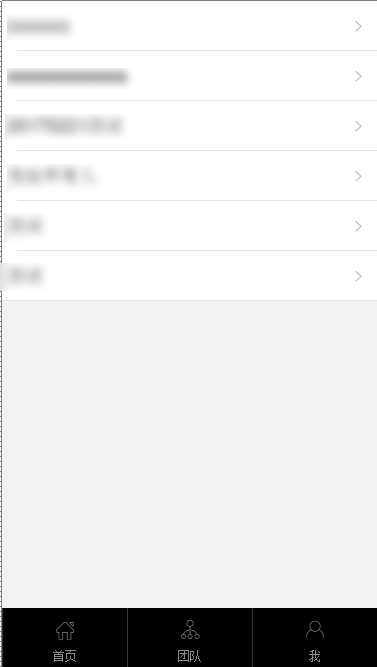
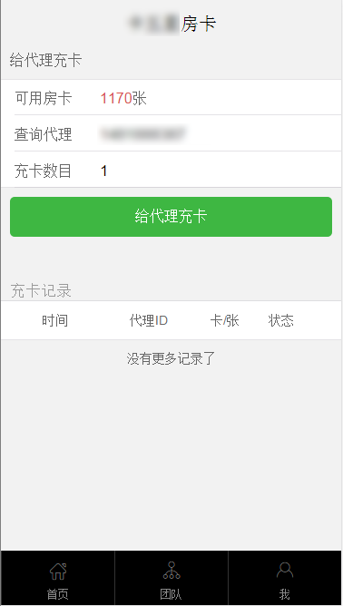

# 1	代理后台前端使用文档
**本文档展示数据仅为测试数据，具体数据请以实物为准！**
## 1.1	系统要求：
**代理后台相当于一个小型的单页应用，仅支持在微信浏览器中使用，无需登陆。**

|	                |IOS	     | Andorid     |
|------------------ |:-----------|:------------|
| 最低系统版本要求    |7.3及以上   | 4.0及以上    | 

* 注意：请尽量安装最新版本的微信。
* Q&A：
* Q：如何进入代理后台？
* A：请关注“牌友圈麻将”代理后台，在微信公众号里点击“游戏充值”里的“申请推广会员”，根据推送的链接选择游戏进入代理后台。
* Q：如何购买房卡？
* A：用户可在自动购卡页面自行购买房卡

## 1.2	首页示意图

### 1.2.1	消息
消息页面

 

点击即可消除未读状态。

### 1.2.2	业绩
业绩页面可以查看销售和提成情况

  

### 1.2.3	房卡销售页面
注意：房卡销售页面各个按钮功能可以由管理员在后台设置，案例中默认开通全部功能，实际使用情况中，可根据用户自身需求设置代理的功能权限。

 
####  1.2.3.1	自动销售
 
点击小齿轮图标可以删除套餐，也可直接将售卡链接分享给代理。

您可以在本页面设置自动售卡链接，点击选择按钮后会进入售卡页面，将该页面分享给代理即可，代理可在此页购买房卡。

 

点击设置快捷方式可以设置套餐，请注意赠卡数量需要在指定范围内。
 
 

#### 1.2.3.2	自动购卡
用户可以在本页面购买房卡，点击充值按钮即可购买，用户可以选择是否通过余额购买。
  
 

#### 1.2.3.3	给代理充卡
用户可以在本页面向代理充卡，输入代理编号会自动查找代理，点击需要的代理即可填入，
下方为给代理充卡记录。

  

#### 1.2.3.4	给玩家充卡
用户可在本页面向玩家充卡和查看充卡信息，用户在给玩家充卡前需查询玩家信息，请务必核查玩家信息，如因用户未正确核实玩家信息而造成房卡损失，本公司概不负责。

### 1.2.4	客服
### 1.2.5	团队
用户点击团队可查看旗下代理，点击代理即可查看代理的销售情况。
 

## 1.3	代开卡功能（此功能暂未开放）
>1.开通本功能需垫付100房卡到资金池，资金池内房卡无法退还

>2.开通本功能后，玩家可以通过绑定功能直接赊欠房卡开房，代理可以通过结算功能来与玩家结算所赊欠房 卡，玩家用卡更方便。

>3.玩家可以在游戏界面通过输入您的代理ID号来与您进行绑定，在代理后台代开房板块中可以通过玩家申请 的绑定请求，每个玩家只能绑定一个代理账号，代理可绑定玩家账号不限。
 
***

用户可在此页面查看玩家申请代开卡的列表和耗卡的明细，代理可以对玩家的申请进行操作，如果‘同意’将对玩家开通此功能，代理可点击‘详情页’进入玩家的详情页，如果拒绝玩家请求吗，玩家可再次在游戏中申请代开卡功能。
### 1.3.1	玩家详情页面
此页面可查看玩家的详细耗卡情况，并且可**解除玩家绑定**，**修改欠卡上限**，和对欠卡进行结算，解除玩家绑定将关闭玩家的代开房功能，修改欠卡上限可将玩家赊卡的上限进行调整，系统仅提供固定数值限制玩家欠卡上限。

### 1.3.2.1 每天的耗卡列表
点击耗卡明细里的列表，可进入查看。。。。。未完待续

## 1.4	我
用户可在此页面进行提现，推广，订单操作及查看余额变动明细。

### 1.4.1	提现

此页面会展示用户的余额，余额购卡和立即提现的权限可由管理员在后台配置，余额购卡按钮将会直接前往自动购卡页面。

### 1.4.2	发展团队
用户可在此页面生成推广海报，将推广海报分享出去，代理扫描二维码，可进入页面。

### 1.4.3	订单中心
用户可在此页面关闭订单和查看订单。

### 1.4.4	余额变动明细
余额变动明细可以查看余额购卡和提现的记录。
 

***
**本文文字及图片版权归武汉晃游网络有限公司所有！**
 
**武汉晃游网络有限公司拥有本文最终解释权！**

